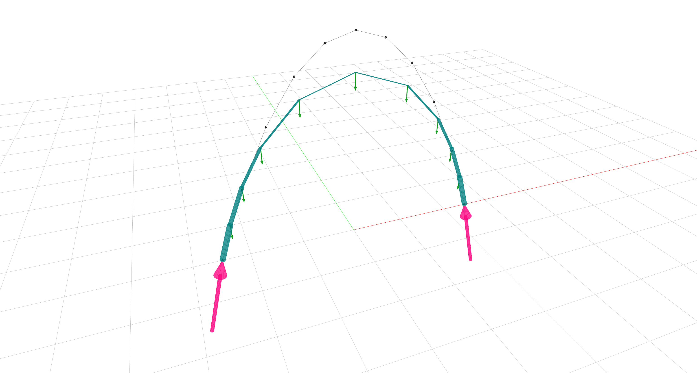

<h1 align='center'>JAX FDM</h1>

<!-- Badges -->

[](https://zenodo.org/badge/latestdoi/534255112)
[](https://pypi.python.org/project/jax-fdm)
[](https://pypi.python.org/project/jax-fdm)
<!-- [](https://github.com/arpastrana/jax_fdm) -->

A differentiable, hardware-accelerated framework for constrained form-finding in structural design.

> Crafted with care in the [Form-Finding Lab](http://formfindinglab.princeton.edu/) at [Princeton University](https://princeton.edu) ❤️🇺🇸


JAX FDM enables the solution of inverse form-finding problems for discrete force networks using the force density method (FDM) and gradient-based optimization.
It streamlines the integration of form-finding simulations into deep learning models for machine learning research.

## Key features

- **Legendary form-finding solver.**
JAX FDM computes static equilibrium states for discrete force networks with the [force density method (FDM)](https://www.sciencedirect.com/science/article/pii/0045782574900450), the time-tested form-finding solver backed up by over 50 years of peer-reviewed research 📚.
<!--  -->
- **Derivatives, JIT compilation and parallelization.**
JAX FDM is written in [JAX](https://github.com/google/jax), a library for high-performance numerical computing and machine learning research, and it thus inherits many of JAX's perks: calculate derivatives, parallelize, and just-in-time (JIT) compile entire form-finding simulations written in Python code, and run them on a CPU, a GPU, or a TPU 🤯.
<!-- The same JAX code can be run in a CPU, or in multiple GPUs or TPUs (🤯). Accelerate your simulations with minimal burden! -->
- **Autotune those force densities, loads and supports.**
A form-found structure should fulfill additional design requirements to become a feasible structure.
Formulate an inverse form-finding scenario like this as an optimization problem with JAX FDM.
Then, let one of its gradient-based optimizers solve the problem by automatically tweaking the network's force densities, applied loads and support positions 🕺🏻.
<!-- Some popular examples of inverse form-finding problems include best-fitting a vault to an arbitrary target shape, minimizing the load path of a funicular network, or controlling the thrust and the supports of a bridge. -->
- **A rich bank of goals, constraints and loss functions.**
No two structures are alike.
JAX FDM allows you to model a custom inverse form-finding problem with its (growing!) collection of goals, constraints, and loss functions via a simple, object-oriented API.
The available goals and constraints in the framework are granular and applicable to an entire network; to a subset of its nodes, edges, and combinations thereof 💡.
<!-- Don't see a goal or a constraint you fit?. Add yours with ease! Consult our documentation guide (in progress) to see how you add yours. -->
- **Form-finding simulations as another layer in a neural network.**
As an auto-differentiable library, JAX FDM can be seamlessly added as a layer in a differentiable function approximator like a neural network that can be then trained end-to-end.
Let the neural network learn the underlying physics of static equilibrium *directly* from the form-finding simulation, instead of resorting to laborious techniques like data augmentation 🤖.

JAX FDM is a research project under development.
Expect sharp edges and possibly some API breaking changes as we continue to support a broader set of features.

## Installation

First, create a new [Anaconda](https://www.anaconda.com/) environment and then activate it:

```bash
conda create -n jaxenv
conda activate jaxenv
```

Next, install COMPAS and COMPAS VIEW2 via `conda`:

```bash
conda install -c conda-forge compas compas_view2==0.7.0 
```

Finally, install JAX FDM with a one-liner via `pip`:

```bash
pip install jax-fdm
```

JAX FDM requires Python 3.7+, JAX 0.3.17+, Numpy 1.23.3+, Scipy 1.9.1+, and COMPAS 1.16.0+.
For visualization, it uses COMPAS_VIEW2 0.7.0.

### Are you a Windows user? 
 
JAX is only officially supported on Linux (Ubuntu 16.04 or later) and macOS (10.12 or later) platforms.
This is the case with JAX FDM too. 
Consequently, installing JAX FDM on Windows may require a different approach from that given by the instructions listed above.

One **working** alternative for Windows users is to install JAX and JAX FDM using the [Windows build for JAX](https://github.com/cloudhan/jax-windows-builder).
Note that this is a community build that has been reported to work **only on Windows 11**.
Another option to install JAX on Windows is to do so via the [Windows Subsystem for Linux](https://learn.microsoft.com/en-us/windows/wsl/about), with the limitation of having marginal graphical output.
Please refer to [JAX's installation instructions](https://github.com/google/jax#installation) for other alternatives to install JAX on Windows.

## Documentation

Work in progress! Expect a release soon.

## Quick example

Suppose you are interested in generating a form in static equilibrium for a 10-meter span arch subjected to vertical point loads of 0.3 kN.
The arch has to be a compression-only structure.
You model the arch as a `jax_fdm` network (download the arch `json` file [here](https://github.com/arpastrana/jax_fdm/blob/main/data/json/arch.json)).
Then, you apply a force density of -1 to all of its edges, and compute the required shape with the force density method. 

```python
from jax_fdm.datastructures import FDNetwork
from jax_fdm.equilibrium import fdm


network = FDNetwork.from_json("data/json/arch.json")
network.edges_forcedensities(q=-1.0)
network.nodes_supports(keys=[node for node in network.nodes() if network.is_leaf(node)])
network.nodes_loads([0.0, 0.0, -0.3])

f_network = fdm(network)
```

You now wish to find a new form for this arch that minimizes the [total Maxwell's load path](https://doi.org/10.1007/s00158-019-02214-w), while keeping the length of the arch segments between 0.75 and 1 meters.
You solve this constrained form-finding problem with the SLSQP gradient-based optimizer.

```python
from jax_fdm.equilibrium import constrained_fdm
from jax_fdm.optimization import SLSQP
from jax_fdm.constraints import EdgeLengthConstraint
from jax_fdm.goals import NetworkLoadPathGoal
from jax_fdm.losses import PredictionError
from jax_fdm.losses import Loss


loss = Loss(PredictionError(goals=[NetworkLoadPathGoal()]))
constraints = [EdgeLengthConstraint(edge, 0.75, 1.0) for edge in network.edges()]
optimizer = SLSQP()

c_network = constrained_fdm(network, optimizer, loss, constraints=constraints)
```

You finally visualize the unconstrained form-found arch `f_network` (gray) and the constrained one, `c_network` (in teal) with the `Viewer`.

```python
from jax_fdm.visualization import Viewer


viewer = Viewer(width=1600, height=900)
viewer.add(c_network)
viewer.add(f_network, as_wireframe=True)
viewer.show()
```



The constrained form is shallower than the unconstrained one as a result of the optimization process.
The length of the arch segments also varies within the prescribe bounds to minimize the load path: segments are the longest where the arch's internal forces are lower (1.0 meter, at the appex); and conversely, the segments are shorter where the arch's internal forces are higher (0.75 m, at the base).

## More examples


### Notebooks

> These notebooks run directly from your browser without having to install anything locally! 

- [Arch](https://colab.research.google.com/drive/1_SrFuRPWxB0cG-BaZtNqitisQ7M3oUOG?usp=sharing): Control the height and the horizontal projection of a 2D arch.
- [3D spiral](https://colab.research.google.com/drive/13hi9VsQ2PSLY2otfyDSvlX3xhpfFJ7zJ?usp=sharing): Calculate the loads required to maintain a compression-only 3D spiral in equilibrium [(Angelillo, et al. 2021)](https://doi.org/10.1016/j.engstruct.2021.112176).
- [Creased masonry vault](https://colab.research.google.com/drive/1I3ntFbAqmxDzLmTwiL8z-pYoiZLC1x-z?usp=sharing): Best-fit a target surface [(Panozzo, et al. 2013)](https://cims.nyu.edu/gcl/papers/designing-unreinforced-masonry-models-siggraph-2013-panozzo-et-al.pdf).


### Scripts

> These python scripts require a local installation of JAX FDM.

- [Pointy dome](https://github.com/arpastrana/jax_fdm/blob/main/examples/dome/dome.py): Control the tilt and the coarse width of a brick dome. 
- [Triple-branching saddle](https://github.com/arpastrana/jax_fdm/blob/main/examples/monkey_saddle/monkey_saddle.py): Design the distribution of thrusts at the supports of a monkey saddle network while constraining the edge lengths.
- [Saddle bridge](https://github.com/arpastrana/jax_fdm/blob/main/examples/pringle/pringle.py): Create a crease in the middle of the bridge while constraining to transversal edges of the network to a target plane. 

## Citation

If you found this library to be useful in academic or industry work, please consider 1) starring the project on Github, and 2) citing it:

```bibtex
@software{pastrana_jaxfdm,
          title={{JAX~FDM}: Auto-differentiable and hardware-accelerated force density method},
          author={Rafael Pastrana and Sigrid Adriaenssens},
          year={2022},
          doi={10.5281/zenodo.7258292},
          url={https://github.com/arpastrana/jax\_fdm}}
```

## Acknowledgements

This work has been supported by the **U.S. National Science Foundation** under grant **OAC-2118201** and the [Institute for Data Driven Dynamical Design](https://www.mines.edu/id4/).

## See also

[COMPAS CEM](https://github.com/arpastrana/compas_cem): Inverse design of 3D trusses with the extended Combinatorial Equilibrium Modeling framework.

[JAX](https://github.com/google/jax): Composable transformations of Python+NumPy programs.

## License

MIT
