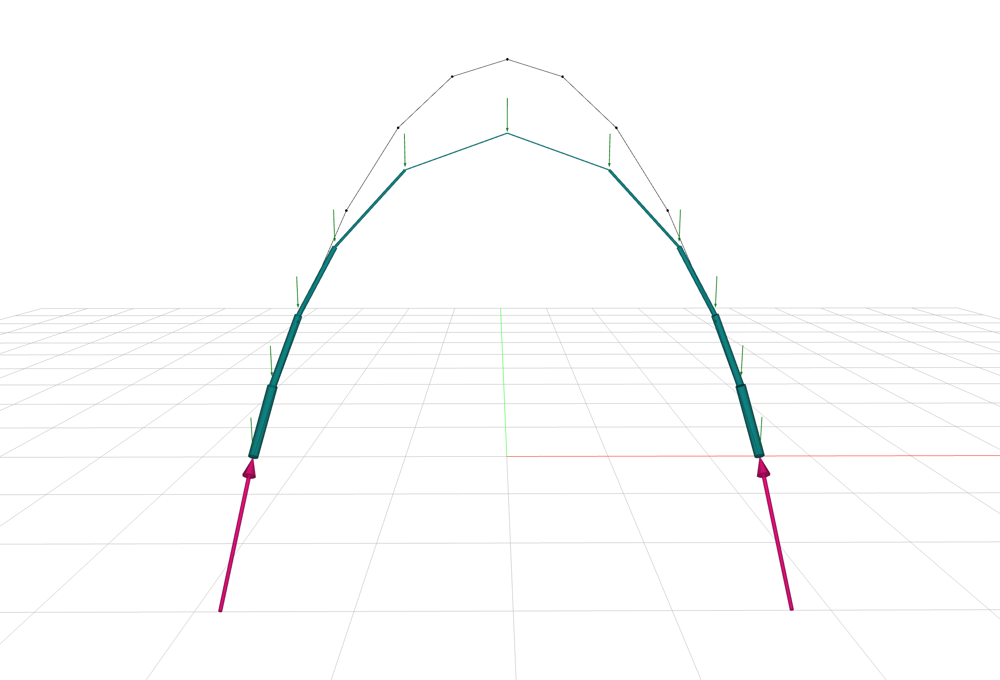

# Examples

## First example

Suppose you are interested in generating a form in static equilibrium for a 10-meter span arch subjected to vertical point loads of 0.3 kN.
The arch has to be a compression-only structure.
You model the arch as a `jax_fdm` network (download the arch `json` file [here](https://github.com/arpastrana/jax_fdm/blob/main/data/json/arch.json)).
Then, you apply a force density of -1 to all of its edges, and compute the required shape with the force density method.

```python
from jax_fdm.datastructures import FDNetwork
from jax_fdm.equilibrium import fdm


network = FDNetwork.from_json("data/json/arch.json")
network.edges_forcedensities(q=-1.0)
network.nodes_supports(keys=[node for node in network.nodes() if network.is_leaf(node)])
network.nodes_loads([0.0, 0.0, -0.3])

f_network = fdm(network)
```

You now wish to find a new form for this arch that minimizes the [total Michell's load path](https://doi.org/10.1007/s00158-019-02214-w), while keeping the length of the arch segments between 0.75 and 1 meters.
You solve this constrained form-finding problem with the SLSQP gradient-based optimizer.

```python
from jax_fdm.equilibrium import constrained_fdm
from jax_fdm.optimization import SLSQP
from jax_fdm.constraints import EdgeLengthConstraint
from jax_fdm.goals import NetworkLoadPathGoal
from jax_fdm.losses import PredictionError
from jax_fdm.losses import Loss


loss = Loss(PredictionError(goals=[NetworkLoadPathGoal()]))
constraints = [EdgeLengthConstraint(edge, 0.75, 1.0) for edge in network.edges()]
optimizer = SLSQP()

c_network = constrained_fdm(network, optimizer, loss, constraints=constraints)
```

You finally visualize the constrained arch `c_network` with the `Viewer`, together with the unconstrained arch `f_network` as a plain wireframe (convert it to a COMPAS `Network` to draw it without the force density styling).

```python
from compas.datastructures import Network
from jax_fdm.visualization import Viewer


viewer = Viewer(width=1600, height=900)
viewer.add(c_network)
viewer.add(f_network.copy(cls=Network))
viewer.show()
```



The constrained form is shallower than the unconstrained one as a result of the optimization process.
The length of the arch segments also varies within the prescribed bounds to minimize the load path: segments are the longest where the arch's internal forces are lower (1.0 meter, at the apex); and conversely, the segments are shorter where the arch's internal forces are higher (0.75 m, at the base).

## More examples

### Jupyter notebooks

These notebooks run directly from your browser without having to install anything locally! Their sources live in the [`notebooks/`](https://github.com/arpastrana/jax_fdm/tree/main/notebooks) folder.

- [Arch](https://colab.research.google.com/drive/1_SrFuRPWxB0cG-BaZtNqitisQ7M3oUOG?usp=sharing): Control the height and the horizontal projection of a 2D arch.
- [3D spiral](https://colab.research.google.com/drive/13hi9VsQ2PSLY2otfyDSvlX3xhpfFJ7zJ?usp=sharing): Calculate the loads required to maintain a compression-only 3D spiral in equilibrium [(Angelillo, et al. 2021)](https://doi.org/10.1016/j.engstruct.2021.112176).
- [Creased masonry vault](https://colab.research.google.com/drive/1I3ntFbAqmxDzLmTwiL8z-pYoiZLC1x-z?usp=sharing): Best-fit a target surface [(Panozzo, et al. 2013)](https://cims.nyu.edu/gcl/papers/designing-unreinforced-masonry-models-siggraph-2013-panozzo-et-al.pdf).

### Python scripts

The scripts require a local installation of JAX FDM.

- [Pointy dome](https://github.com/arpastrana/jax_fdm/blob/main/examples/dome/dome.py): Control the tilt and the coarse width of a brick dome.
- [Triple-branching saddle](https://github.com/arpastrana/jax_fdm/blob/main/examples/monkey_saddle/monkey_saddle.py): Design the distribution of thrusts at the supports of a monkey saddle network while constraining the edge lengths.
- [Saddle bridge](https://github.com/arpastrana/jax_fdm/blob/main/examples/pringle/pringle.py): Create a crease in the middle of the bridge while constraining the transversal edges of the network to a target plane.