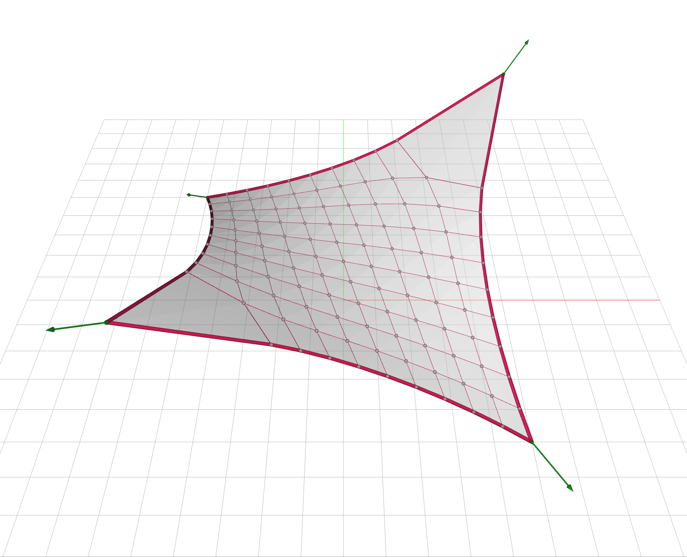
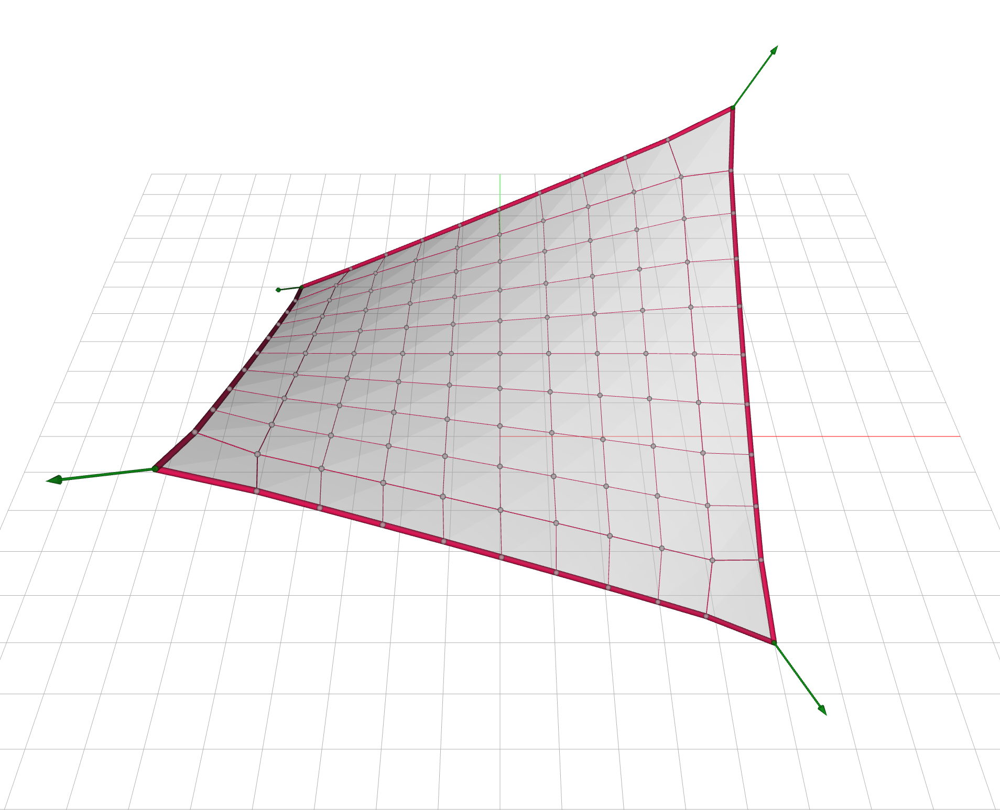
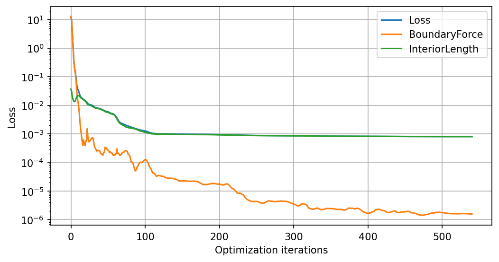

# Cable-net Prestress

A cable-net has no bending stiffness.
Its stiffness is rather *geometric*, and is a function of how much the cables are pulling, which simultaneously defines the net's shape.
Geometry and forces are intrinsically coupled.
If we change how much the net pulls, its shape moves; if we modify the net's shape, the forces will follow.
This coupling is precisely what makes prestress design intellectually stimulating.

Tensile roofs are generally specified in force terms.
The boundary cables that gather the whole net and carry it to the anchors have a working force they are sized for, and the interior cables want a regular spacing so the net can be cut, clamped and clad from repeating parts.
Neither of those is a shape we can draw *a priori*.
They are properties we would want the cable-net to reach.

This example will walk us through the design of a square cable-net hung from four corners.
We will start by setting cable force densities from the forces we want on the cables at the net's boundaries, and discover that the form-found net with the FDM misses those numbers.
To reach those forces, subject to all the internal cables having an equal target length for buildability, we will define goals, and let a gradient-based optimizer find the best force densities that fulfill our desiderata.
Let's go.

## The net

Suppose we envision a square mesh grid, 10 meters on a side, cut into 10 cells per direction.
`FDMesh.from_meshgrid` gives us the quad mesh, and we split its edges into the two families: the cables around the perimeter and the internal cables.

```python
from jax_fdm.datastructures import FDMesh


length = 10.0  # m
nx = 10

mesh = FDMesh.from_meshgrid(length, nx=nx)

edges_boundary = [edge for edge in mesh.edges() if mesh.is_edge_on_boundary(edge)]
edges_interior = [edge for edge in mesh.edges() if not mesh.is_edge_on_boundary(edge)]
```

The four corners are the only supports.
On a mesh grid they are the only vertices with two neighbors, so `vertices_where(vertex_degree=2)` finds them *topologically*, without us counting indices.
We anchor all four, then lift one *diagonal* pair to 5 meters and leave the other pair on the ground.

```python
support_height = 5.0  # m

corners = list(mesh.vertices_where(vertex_degree=2))
mesh.vertices_supports(corners)
mesh.vertex_attribute(corners[0], "z", support_height)
mesh.vertex_attribute(corners[-1], "z", support_height)
```

Lifting a diagonal pair, rather than an adjacent one, is what makes the net anticlastic because it curves up along one diagonal and down along the other, saddle-like.
That double curvature helps keep a tensile surface taut.

## Guessing force densities

Now the prestress.
A force density is a ratio of force per unit length, in kN/m, and we can set it directly by dividing the force we want on each cable by how long that cable currently is.

```python
force_boundary = 20.0  # kN
force_interior = 1.0  # kN

for edge in mesh.edges():
    force = force_boundary if mesh.is_edge_on_boundary(edge) else force_interior
    mesh.edge_forcedensity(edge, force / mesh.edge_length(edge))
```

We want the boundary cables to pull twenty times harder than the interior ones.
That ratio is the usual arrangement in a tensile roof, where a stiff, highly stressed edge cable keeps the perimeter taut and gives the light interior net something to hang from.

Note that the divisor is the length the edge has in its *reference configuration*, in the lifted-but-not-yet-solved grid.
For most edges that is the 1 meter of the original grid.
But the four edges touching the two raised corners have already been stretched to about 5.1 meters by the lift, so they receive a force density near 3.9 kN/m rather than 20 kN/m.
We will see that show up in a moment.

## Before: close, but not quite

We form-find the net with a single `fdm` call:

```python
from jax_fdm.equilibrium import fdm


cablenet = fdm(mesh)
```



The surface is a clean saddle, and it is in pure-tension equilibrium.
But wait.
The numbers we asked for are not there:

| Quantity | Target | Form-found |
| --- | --- | --- |
| Boundary force (kN) | 20.0 | 15.16 to 18.27 |
| Interior length (m) | 1.0 | 0.78 to 1.80 |

The boundary cables all fall short, and the interior cables are anything but regular: the longest is more than twice the shortest.
Look at the picture and you can see the second one directly, in how the grid bunches up near the middle of the saddle and stretches open toward the raised corners.

The reason is the coupling we started with.
We divided by the length each edge had *before* the solve, but the solve moves everything.
Once the net settles, each edge has a new length, and its force is the force density we fixed times that new length, not the number we had in mind.
That is to say, the length comes from the net's *updated, equilibrium configuration* after undergoing large deformations — a topic that the structural mechanics folk would be very familiar with.
This is the crux of performing a linearized form-finding with the FDM: it is stable and fast, but it seldom lands where we originally imagined.

## Welcome to nonlinear land

To actually land on the targets, we have to enter the land of nonlinearity.
We state the targets as nonlinear goals and let the optimizer iteratively search for the force densities that meet them.

The design variables in the optimization are the force densities of every edge.
We bound them from below, which is what keeps this a cable-net: a negative force density would mean a strut pushing, and no cable can do that.
The floor sits at 0.1 kN/m rather than at zero, so that no cable is allowed to go slack either.

```python
from jax_fdm.parameters import EdgeForceDensityParameter


qmin = 0.1  # kN/m
qmax = None

parameters = [EdgeForceDensityParameter(edge, qmin, qmax) for edge in mesh.edges()]
```

Then the two things we want, one per edge family.
The boundary cables get a **force** goal, because their force is what sizes them and their anchors.
The interior cables get a **length** goal, because their regularity is what makes the net buildable from repeatable parts.

```python
from jax_fdm.goals import EdgeForceGoal
from jax_fdm.goals import EdgeLengthGoal


length_interior = 1.0  # m

goals_force = [EdgeForceGoal(edge, target=force_boundary) for edge in edges_boundary]
goals_length = [EdgeLengthGoal(edge, target=length_interior) for edge in edges_interior]
```

Both families are measured the same way, as a mean squared error against their target, and fed into one loss.
Naming the terms is worth the keystrokes, since the optimizer reports them separately and it is useful to see which of the two is holding out.

```python
from jax_fdm.losses import Loss
from jax_fdm.losses import MeanSquaredError


loss = Loss(
    MeanSquaredError(goals_force, name="BoundaryForce"),
    MeanSquaredError(goals_length, name="InteriorLength"),
)
```

## After: prestressed and buildable

We hand the loss, the parameters and a bounded gradient-based optimizer to `constrained_fdm`.
We also hand it an `OptimizationRecorder` as a callback, which stores the parameters at every iteration so that we can chart the convergence afterwards.

```python
from jax_fdm.equilibrium import constrained_fdm
from jax_fdm.optimization import LBFGSB
from jax_fdm.optimization import OptimizationRecorder


optimizer = LBFGSB()
recorder = OptimizationRecorder(optimizer)

cablenet_prestressed = constrained_fdm(
    mesh,
    optimizer=optimizer,
    loss=loss,
    parameters=parameters,
    maxiter=1000,
    tol=1e-8,
    callback=recorder,
)
```



`LBFGSB` is a sensible optimizer here because our only restriction on the design variables is a box, wherein every force density has to stay positive.
That is a bound, not a constraint function, so a bound-constrained quasi-Newton method handles it natively and cheaply.
The 220 force densities converge in a fraction of a second.

| Quantity | Target | Form-found | Optimized |
| --- | --- | --- | --- |
| Boundary force (kN) | 20.0 | 15.16 to 18.27 | 19.998 to 20.002 |
| Interior length (m) | 1.0 | 0.78 to 1.80 | 0.97 to 1.05 |

The boundary cables now carry an internal tension force of 20 kN, to within a few thousandths.
The length of the interior cables is 1.0 meter as desired on average, with an error between 3% and 5%, which construction tolerances and good connection engineering can accommodate.
In the picture above, the interior grid now reads as an even mesh across the whole surface, as we originally imagined, instead of one that crowds at the center.

## Watching the loss converge

The optimizer reports a single number when it stops, a final loss of 0.0008.
That tells us it converged, but not which of our two demands was the hard one, nor when.
`LossPlotter` answers both by replaying the recorded parameter history through the loss and charting every named term next to the total.
This is where naming the error terms earlier pays off.

```python
from jax_fdm.visualization import LossPlotter


plotter = LossPlotter(loss, mesh, dpi=150, figsize=(8, 4))
plotter.plot(recorder.history)
plotter.show()
```

{ width="80%" .center }

The plotter also prints the same series as numbers:

| Term | First | Last |
| --- | --- | --- |
| Loss | 12.695 | 0.000804 |
| BoundaryForce | 12.659 | 0.000002 |
| InteriorLength | 0.036 | 0.000803 |

The interesting part is how the two terms swap roles.
At the start the boundary force error is 99.7% of the loss, and the interior length error is almost invisible beside it.
By the end that has inverted: the boundary force error has fallen close to seven orders of magnitude, while the interior length error drops only 45-fold and ends up as 99.8% of what little is left.
The term that dominates at the beginning is not the one that limits us at the end.

There is a structural reason for the split.
Forty boundary cables are asked for a force, and the optimizer has enough freedom in the force densities to grant it almost exactly.
The other 180 cables are asked for a length, and 180 interior lengths simply cannot all be 1.0 meter at once on a doubly curved surface, so they settle into the best compromise available.
That plateau *is* the 0.97 to 1.05 meter spread in the table above.
The curve shows us why that row does not read 1.00.

Notice too that after roughly a hundred iterations the `Loss` curve disappears behind `InteriorLength`.
The total is the sum of its terms, so once one term dominates, the two lines coincide.

!!! note "A word on weights"

    Every error term carries an `alpha` weight that defaults to 1.0, and the curves the plotter draws already include it.
    Here both terms are unweighted, so the curves are the plain mean squared errors and they add up to the total exactly, which is what makes the chart above so easy to read.
    Raising `alpha` on one term scales its curve and pulls the optimizer toward that demand at the expense of the other.
    That knob matters more than it looks, because the two terms are not even in the same units: the boundary force error is measured in kN² and the interior length error in m².
    Their sum is a design objective rather than a physical quantity, and `alpha` is how we say which half of it we care about more.

## Reading the result

`print_stats` reports the usual per-edge quantities, and takes an `extra_stats` mapping so we can watch precisely the two numbers this design is about, rather than reading them out of the global ranges.

```python
extra_stats = {
    "Boundary force": [cablenet_prestressed.edge_force(e) for e in edges_boundary],
    "Interior length": [cablenet_prestressed.edge_length(e) for e in edges_interior],
}

cablenet_prestressed.print_stats(extra_stats)
```

To view the net, we add it to the `Viewer` with `edgecolor="force"`.
That colors edges by the *sense* of their force rather than its size, so a cable-net comes out in a single tension color throughout (red), which is itself a useful check that nothing flipped into compression (blue).
Moreover, the individual cable thickness is proportional to its internal axial force magnitude, so thicker edges will exhibit higher forces, and vice versa.
Note that since that width scale is remapped within each net, thicknesses are worth reading inside one picture but not across the two above.

```python
from jax_fdm.visualization import Viewer


viewer = Viewer(width=1200, height=800, show_grid=True)

viewer.add(
    cablenet_prestressed,
    edgecolor="force",
    show_vertices=True,
    reactionscale=0.05,
    faceopacity=0.5,
)

viewer.show()
```

If you were wondering, the green arrows at the corners are the support reactions, and they need `reactionscale` to be readable, otherwise they go out of the view!
Each anchor pulls with a force of roughly 27 to 33 kN, so drawn true to size the arrows would be three times longer than the net is wide — they would blow up out of the camera!
At 0.05 they stay inside the frame while still showing which way each corner is being dragged.

Faces are opaque by default, and `faceopacity` softens them.
At 0.5 the ground grid reads through the surface, which keeps the net looking like the membrane it is rather than a solid slab.

## Where to next

- Comprehensive summary of goals, losses, parameters and optimizers?
  Read [constrained form-finding](../howto/constrained_form_finding.md).
- Looking for the full catalog of goals you can target?
  See the [goals guide](../howto/goals.md).
- Need a target met *exactly* rather than approximately?
  A hard bound is a [constraint](../howto/constraints.md), not a goal.
- The runnable script for this example lives in [`examples/cablenet/cablenet.py`](https://github.com/arpastrana/jax_fdm/blob/main/examples/cablenet/cablenet.py).
