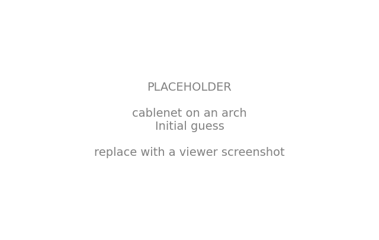
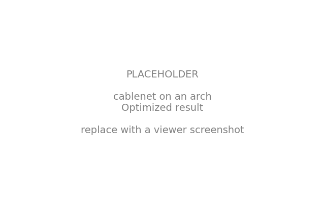

# Cablenet on an Arch

A hanging net does not need to be pinned to the ground everywhere.
Sometimes we want it to drape off a curved support, an arch, so that it billows down from a ridge into a canopy people can walk under.
This example is inspired by a lovely [`compas_fd` walkthrough](https://blockresearchgroup.github.io/compas_fd/latest/examples/example_mesh_constrained_on-arch.html) in which a mesh hangs off a NURBS arch, its center vertices free to slide along the curve until they find equilibrium.

We rebuild that scene in JAX FDM and then push it further, because form-finding with a differentiable solver lets us do three things the one-shot solve does not:

- **optimize** the force densities, instead of accepting whatever a fixed set produces,
- **rotate** the arch to an arbitrary angle and still find a clean equilibrium,
- **stack extra goals** into the same problem with almost no extra code, here a target force for the boundary cables and a walk-under clearance for the net.

Along the way we build the arch from scratch with a few lines of `numpy`, so there is no NURBS library to install.

## The scene

We start from a square cablenet: a `FDMesh` meshgrid, centered on the origin.

```python
from compas.geometry import Translation

from jax_fdm.datastructures import FDMesh


length = 10.0
nx = 20

mesh = FDMesh.from_meshgrid(length, nx=nx)
mesh.transform(Translation.from_vector([-length / 2.0, -length / 2.0, 0.0]))
```

## An arch without NURBS

The competing example reaches for a NURBS curve to describe the arch.
We do not need one: a **circular arc** is fully determined by its span and its rise, and we can place points along it with plain trigonometry.

The arc lives in the vertical plane `x = 0` and passes through three points, the two feet on the ground and the apex at the top.
Its center sits on the vertical axis at a height `z_center`, and a little algebra gives us that height and the radius from the span and rise alone.

```python
import numpy as np


rise = 5.0
half_span = length * 0.75  # the arch reaches a little past the net

z_center = (rise**2 - half_span**2) / (2.0 * rise)
radius = np.hypot(half_span, z_center)
```

To read a point off the arc we sweep an angle from one foot to the other.
We also let the whole arch **rotate** about the vertical axis by `angle` degrees, so it need not sit square to the mesh.

```python
from math import radians

from compas.geometry import Rotation
from compas.geometry import transform_points


angle = 25.0  # rotation of the arch about the vertical axis


def arch_point(sweep_angle):
    y = radius * np.cos(sweep_angle)
    z = z_center + radius * np.sin(sweep_angle)
    point = [0.0, float(y), float(z)]

    rotation = Rotation.from_axis_and_angle([0.0, 0.0, 1.0], radians(angle))

    return transform_points([point], rotation)[0]
```

Now we pin one column of the mesh onto the arch.
We grab the center column of vertices, sort them along `y`, and drop each one onto an evenly spaced station along the arc.

```python
arch_vertices = sorted(mesh.vertices_where(x=0.0), key=lambda v: mesh.vertex_attribute(v, "y"))

sweep_start = np.arctan2(-z_center, -half_span)
sweep_end = np.arctan2(-z_center, half_span)
sweep = np.linspace(sweep_start, sweep_end, len(arch_vertices))
arch_points = [arch_point(a) for a in sweep]

for vertex, point in zip(arch_vertices, arch_points):
    mesh.vertex_attributes(vertex, "xyz", point)
```

The arch defines a plane, and we will need its normal in a moment.
Because the arc lies in a single (rotated) plane, the normal is the cross product of any in-plane edge with the vertical.

```python
from compas.geometry import cross_vectors


edge_vector = [b - a for a, b in zip(arch_points[0], arch_points[1])]
normal = cross_vectors(edge_vector, [0.0, 0.0, 1.0])
```

## Supports, cables, and loads

The arch column is fixed, and so are the four mesh corners.
Together they are the only supports, so every other vertex is free to hang.

```python
fixed = arch_vertices + list(mesh.vertices_where(vertex_degree=2))
for vertex in fixed:
    mesh.vertex_support(vertex)
```

We single out the **free boundary edges**, the perimeter cables that run between the corners without touching the arch.
These are the ones we will later ask to carry a single, uniform force.

```python
boundary_edges = [
    edge
    for edge in mesh.edges()
    if mesh.is_edge_on_boundary(edge) and not mesh.is_edge_fully_supported(edge)
]
```

The supports also carve the boundary into distinct **cables**: each cable is a run of free vertices between one anchor and the next, going around the perimeter.
We will want to lift just the *middle* of each cable later, so we walk the ordered boundary ring, cut it at every support, and keep the midpoint of each free chain.
Lifting only the midpoints lets the cables keep their natural sag between anchors, instead of flattening the whole edge.

```python
fixed_set = set(fixed)
ring = mesh.vertices_on_boundary()
if ring[0] == ring[-1]:
    ring = ring[:-1]

cables = []
chain = []
for vertex in ring:
    if vertex in fixed_set:
        if chain:
            cables.append(chain)
            chain = []
    else:
        chain.append(vertex)
# the ring wraps around, so stitch a trailing chain onto the first one
if chain:
    if ring[0] not in fixed_set and cables:
        cables[0] = chain + cables[0]
    else:
        cables.append(chain)

cable_midvertices = [cable[len(cable) // 2] for cable in cables]
```

Finally we seed the force densities: a stiff perimeter, a uniform interior, and a slack strip of edges hanging directly off the arch.

```python
for edge in mesh.edges():
    q = 1.0
    if mesh.is_edge_on_boundary(edge):
        q = 3.0
    elif mesh.is_edge_fully_supported(edge):
        q = 0.1
    mesh.edge_forcedensity(edge, q)
```

## Before: an uneven first guess

We form-find once to see what the seed force densities produce.

```python
from jax_fdm.equilibrium import fdm


mesh_guess = fdm(mesh)
```



The net hangs in equilibrium, but it is far from what we want.
The rotated arch pulls the mesh asymmetrically, so the reactions at the arch supports tilt out of the arch's plane, the perimeter cables carry an uneven force ranging from about 0.7 to 3.4, nearly a five-to-one spread, and the cable midpoints sag as low as 0.95 meters, too low to walk under.
No single set of force densities picked by hand will fix all three at once.
That is what the optimizer is for.

## Three goals, one loss

We express our three intentions as three families of goals and add them into a single loss.
Because each goal is defined on one element and batched by the numerical core, adding a new intention costs us one more list, no more.

**Reactions in the arch plane.** A [`VertexResidualPlaneGoal`](../api/jax_fdm.goals.md) drives the reaction at each arch vertex into the plane whose normal we computed above, so the arch carries its load cleanly in its own plane rather than being pushed sideways.

```python
from jax_fdm.goals import VertexResidualPlaneGoal


goals_residual = [VertexResidualPlaneGoal(v, target=normal) for v in arch_vertices[1:-1]]
```

**One force for every boundary cable.** An [`EdgeForceGoal`](../api/jax_fdm.goals.md) on each free perimeter edge aims them all at the same value, so the whole boundary can be built from a single cable size, the same fabrication payoff as the [equal-force truss](truss_equal_force.md).

```python
from jax_fdm.goals import EdgeForceGoal


cable_force = 2.0
goals_force = [EdgeForceGoal(edge, target=cable_force) for edge in boundary_edges]
```

**A safe height to walk under.** A [`VertexZCoordinateGoal`](../api/jax_fdm.goals.md) lifts the midpoint of each boundary cable up to a target clearance, so the lowest point of every drooping edge clears head height while the cable keeps its sag.

```python
from jax_fdm.goals import VertexZCoordinateGoal


clearance = 3.0
goals_height = [VertexZCoordinateGoal(v, target=clearance) for v in cable_midvertices]
```

We bundle the three families into one loss, each as its own mean-squared-error term so we can read their contributions apart.

```python
from jax_fdm.losses import Loss
from jax_fdm.losses import MeanSquaredError


loss = Loss(
    MeanSquaredError(goals_residual, name="ReactionInPlane"),
    MeanSquaredError(goals_force, name="EqualCableForce"),
    MeanSquaredError(goals_height, name="WalkUnderClearance"),
)
```

The design variables are the force densities of every edge that is not locked between two supports.

```python
from jax_fdm.parameters import EdgeForceDensityParameter


parameters = [
    EdgeForceDensityParameter(edge, 0.1, 50.0)
    for edge in mesh.edges()
    if not mesh.is_edge_fully_supported(edge)
]
```

## After: one solve, three intentions met

We hand the loss and parameters to `constrained_fdm`.

```python
from jax_fdm.equilibrium import constrained_fdm
from jax_fdm.optimization import LBFGSB


mesh_opt = constrained_fdm(
    mesh,
    optimizer=LBFGSB(),
    loss=loss,
    parameters=parameters,
    maxiter=5000,
    tol=1e-6,
)
```



The optimizer moves all three targets at once.
The perimeter cables settle onto a single force, every one of them between 1.96 and 2.03, essentially the 2.0 we asked for, down from the five-to-one spread.
The midpoint of every cable lifts to 3.00 meters, right at the clearance we asked for, while the rest of each cable keeps its sag, so the canopy is walkable without looking flattened.
And the arch reactions rotate into the arch's plane, so the rotated support carries its load without being shoved sideways.

!!! tip "Why stacking goals is the point"

    Each of these three intentions could be a separate study. What makes the differentiable force density method powerful is that they compose: we write one more goal, add one more error term, and the same gradient-based solve balances them together, trading a touch of one against another to satisfy all three. Reaching for a hard guarantee instead of a soft target? Swap a goal for a [constraint](../howto/constraints.md).

## Reading the result

We can confirm the numbers straight off the optimized mesh.

```python
forces = [mesh_opt.edge_force(edge) for edge in boundary_edges]
heights = [mesh_opt.vertex_attribute(v, "z") for v in cable_midvertices]

print(f"Boundary force: min {min(forces):.3f}  max {max(forces):.3f}")
print(f"Cable-midpoint height: min {min(heights):.3f}  max {max(heights):.3f}")
```

To see it, we draw the initial guess as a plain grey wireframe, the optimized net colored by its force densities, and the arch as a cyan polyline.

```python
from compas.colors import Color
from compas.datastructures import Mesh
from compas.geometry import Polyline

from jax_fdm.visualization import Viewer


viewer = Viewer()

viewer.add(mesh_guess.copy(cls=Mesh), show_faces=False, edgecolor=(0.4, 0.4, 0.4))
viewer.add(
    mesh_opt,
    fuse=False,
    edgewidth=(0.01, 0.1),
    edgecolor="fd",
    show_reactions=True,
    show_loads=False,
)
viewer.add(Polyline(arch_points), linecolor=Color.cyan(), lineswidth=3, show_points=False)

viewer.show()
```

## Where to next

- Curious how goals, losses, and the optimizer fit together? Read [constrained form-finding](../howto/constrained_form_finding.md).
- Want to chase a single force target in a simpler setting? See the [equal-force truss](truss_equal_force.md).
- The runnable script for this example lives in [`examples/cablenet_arch/cablenet_arch.py`](https://github.com/arpastrana/jax_fdm/blob/main/examples/cablenet_arch/cablenet_arch.py).
