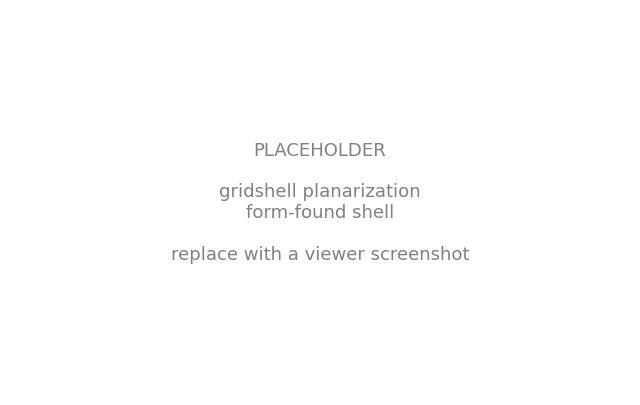
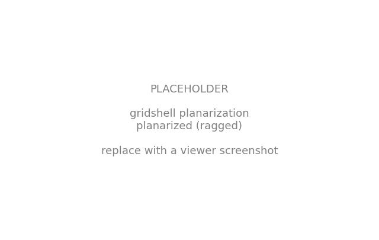
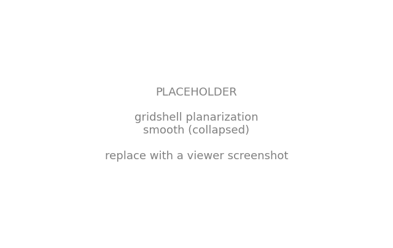
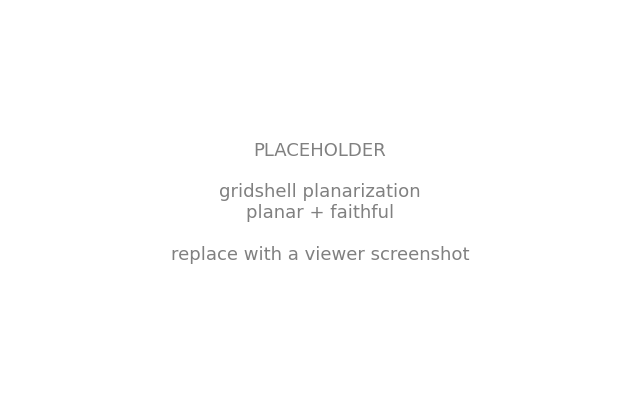
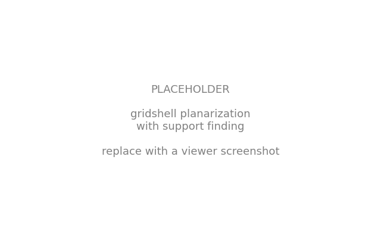

# Gridshell Planarization

The [shape matching](shape_matching.md) example chased a target *surface*. This one chases a target *panel*: we reshape a compression gridshell so that every one of its quad faces is flat, because flat panels are what make a gridshell affordable to clad.

A gridshell is only as buildable as its cladding. Cover it in glass or metal and each quad face becomes a panel to fabricate. A **planar** quad is cut from flat stock, so it is cheap, standard, and interchangeable. A **warped** quad has to be cold-bent, cast on a custom mould, or split into triangles, all of which cost money and multiply the parts. On a doubly-curved shell the faces are warped by default, so planarizing the mesh, nudging every quad until its four corners share a plane, is one of the highest-leverage moves in the economy of a built gridshell.[^pq]

The catch is that planarity fights the other things we care about, structure and appearance, and chasing it naively makes those worse. In this walkthrough we build the design up one goal at a time and watch the trade-offs play out: planarize, then fair, then restore the shape, and finally let the supports move too.

## The compression shell

We start from a square quad gridshell: a `FDMesh` meshgrid, centered on the origin.

```python
from compas.geometry import Translation

from jax_fdm.datastructures import FDMesh


length = 10.0
nx = 8

mesh = FDMesh.from_meshgrid(length, nx=nx)
mesh.transform(Translation.from_vector([-length / 2.0, -length / 2.0, 0.0]))
```

We support the four corners and, to make the design a little more interesting, one full boundary side. A downward load hangs on every free vertex, and a negative force density puts the shell in compression. We give the free boundary edges a stiffer force density than the interior, so the perimeter tautens and the shell spreads to cover more area underneath.

```python
pz = -1.0
q0 = -1.0
q0_boundary = -5.0

corners = list(mesh.vertices_where(vertex_degree=2))
side = list(mesh.vertices_where(x=-length / 2.0))
for vertex in corners + side:
    mesh.vertex_support(vertex)

for vertex in mesh.vertices_free():
    mesh.vertex_load(vertex, [0.0, 0.0, pz])

for edge in mesh.edges():
    if mesh.is_edge_on_boundary(edge) and not mesh.is_edge_fully_supported(edge):
        mesh.edge_forcedensity(edge, q0_boundary)
    else:
        mesh.edge_forcedensity(edge, q0)
```

Form-finding gives us a funicular compression shell.

```python
from jax_fdm.equilibrium import fdm


shell = fdm(mesh)
```



The shell rises to about 7.2 meters. But it is doubly curved, so its quad faces are warped: the worst face reads a flatness of **6.4**, meaning six times past the tolerance we can build to, and only **50% of the faces** come in under the threshold. Clad as-is, half the panels would need bending or a bespoke mould. We would like the faces flat.

!!! note "Measuring flatness against a budget"

    A raw distance ("the worst quad is 142 mm out of plane") tells us little without knowing the panel size, so we use the scale-free planar-quad measure that COMPAS's `mesh.face_flatness` computes: the *diagonal gap* (the shortest distance between a quad's two diagonals, which meet only when it is flat) divided by the average edge length, and then divided by a manufacturing tolerance `maxdev`, taken here as the practical 2%. The reading is thus a fraction of the flatness budget: **below 1.0 a panel is within tolerance and can be clad flat; above 1.0 it cannot.**

## Planarize: flat faces at a price

The force densities are our design variables, kept negative so the shell stays in compression. The [`MeshPlanarityGoal`](../api/jax_fdm.goals.md) drives the average face non-planarity to zero.

```python
from jax_fdm.equilibrium import constrained_fdm
from jax_fdm.goals import MeshPlanarityGoal
from jax_fdm.losses import Loss
from jax_fdm.losses import PredictionError
from jax_fdm.optimization import LBFGSB
from jax_fdm.parameters import EdgeForceDensityParameter


parameters = [EdgeForceDensityParameter(edge, -50.0, -0.01) for edge in mesh.edges()]

loss = Loss(PredictionError([MeshPlanarityGoal()], name="Planarity"))

shell_planar = constrained_fdm(
    mesh,
    optimizer=LBFGSB(),
    loss=loss,
    parameters=parameters,
    maxiter=5000,
    tol=1e-8,
)
```

The faces flatten dramatically, the worst dropping from 6.4 to about **1.2** times the tolerance and **97% of the faces** now under the threshold, up from 50%, and the shell stays in compression. But look closely and the surface has gone **ragged**: pushing the quads flat one edge-force at a time buckles the net into little peaks and valleys, and our raggedness measure actually *rises*. A planar-but-jagged shell is no easier to build than a smooth-but-warped one, so we are not done.



## Fair the net: smoothing as a regularizer

The raggedness is a classic symptom of an under-constrained optimization: many force-density combinations flatten the faces, and the optimizer lands on a spiky one. The remedy is to add a **fairness energy**, a term that prefers smooth solutions, as a regularizer.

We use the [`MeshSmoothGoal`](../api/jax_fdm.goals.md), the discrete fairness energy of Tang et al.: each vertex is drawn toward the centroid of its neighbors, so the surface irons itself out.[^tang]

```python
from jax_fdm.goals import MeshSmoothGoal


loss = Loss(
    PredictionError([MeshPlanarityGoal()], alpha=1.0, name="Planarity"),
    PredictionError([MeshSmoothGoal()], alpha=0.03, name="Smoothness"),
)
```

The raggedness collapses and the faces stay flat, with **100% of the faces** now under the threshold, so on those two counts we have won. But the fairness energy has a side effect we cannot ignore: left to its own devices it fairs the shell toward its *flattest* possible state, and with only force densities to play with, the optimizer squashes the whole shell to the ground. The rise drops from 7 meters to under half a meter, and the geometry drifts more than 4 meters from the shape we started with.



!!! warning "Smoothing pulls the shell flat"

    On its own, `MeshSmoothGoal` minimizes toward a flat sheet, the lowest-energy fair surface. It fairs the net beautifully and flattens the shell along with it. Something has to anchor the height.

## Restore the design: shape matching

We come full circle by adding the goal from the [shape matching](shape_matching.md) example: a per-vertex [`VertexPointGoal`](../api/jax_fdm.goals.md) that pulls every free vertex back toward its position on the original form-found shell. It anchors the rise the smoothing goal was giving away, and biases the whole solution toward the design we intended.

```python
from jax_fdm.goals import VertexPointGoal


shape = {vertex: shell.vertex_coordinates(vertex) for vertex in mesh.vertices_free()}
goals_shape = [VertexPointGoal(vertex, target=shape[vertex]) for vertex in mesh.vertices_free()]

loss = Loss(
    PredictionError([MeshPlanarityGoal()], alpha=1.0, name="Planarity"),
    SquaredError(goals_shape, alpha=0.001, name="ShapeFidelity"),
    PredictionError([MeshSmoothGoal()], alpha=0.03, name="Smoothness"),
)
```

Now the three goals balance. The shell recovers its rise (back to about 6.9 meters), the faces stay flat with **94% of the faces** under the threshold (worst about **1.5** times tolerance), and the surface stays fair, all while remaining a compression-only structure close to the shape we designed. The three weights are the design knobs: dialing them trades panel flatness against fairness against fidelity to the original form.



!!! tip "Why three goals and not one"

    Each goal alone fails: planarity ragged, smoothing collapsed, shape unplanar. It is their *composition* that lands a buildable design, and the differentiable force density method balances them in a single gradient-based solve. Weighting them is how a designer expresses which trade-off they prefer.

## Going further: let the supports move

So far the optimizer has only moved force densities. But the boundary supports are geometry too, and the differentiable method can treat them as design variables just as readily, something a forward form-finder cannot do. This is *support finding*: we let each support on the pinned side slide in and out of the edge, so the optimizer places the supports where they best serve the three goals at once.

```python
from jax_fdm.parameters import VertexSupportXParameter


parameters = [EdgeForceDensityParameter(edge, -50.0, -0.01) for edge in mesh.edges()]
parameters += [
    VertexSupportXParameter(vertex, -length / 2.0, length / 2.0)
    for vertex in side
]
```

With the supports free to move, the same three-goal solve finds a better optimum: the worst face drops to about **0.5** of the tolerance, so **100% of the faces** are now within the flatness budget, up from 94%, as the boundary reshapes itself to help the faces lie flat. The supports travel about half a meter on average to get there.



## Reading the result

We can read the panel flatness straight off the mesh with COMPAS, as a fraction of the manufacturing tolerance, and count how many panels come in under budget:

```python
import numpy as np


maxdev = 0.02  # 2% flatness tolerance
flatness = [shell_planar.face_flatness(face, maxdev=maxdev) for face in shell_planar.faces()]

print(f"Face flatness (fraction of tolerance): mean {np.mean(flatness):.2f}  max {np.max(flatness):.2f}")
print(f"Panels within tolerance: {sum(f <= 1.0 for f in flatness)} of {len(flatness)}")
```

To see it, we color each face by its flatness on a shared scale, so the initial shell reads hot (warped) and the optimized one cool (flat), and the worst panels stand out.

## Summary

Adding one goal at a time traces the whole trade-off. Each column is a design quantity: the shell's rise, the worst face's flatness (as a fraction of the 2% budget), the share of panels under that budget, and how far the geometry drifts from the form-found shell.

| Stage | Rise (m) | Worst flatness | Faces under budget | Shape drift (m) |
| --- | --- | --- | --- | --- |
| Form-found shell | 7.2 | 6.4 | 50% | — |
| Planarize | 6.8 | 1.2 | 97% | 1.13 |
| + Smoothing | 0.5 | 0.2 | 100% | 4.30 |
| + Shape matching | 6.8 | 1.5 | 94% | 0.38 |
| + Support finding | 6.9 | 0.5 | 100% | 0.37 |

Read down the rows: planarizing flattens the panels but ragged; smoothing perfects flatness but collapses the shell and abandons the design (drift 4.3 m); shape matching restores the form at a small flatness cost; and support finding recovers full buildability while holding the shape. No single goal wins on every column, which is exactly why we compose them.

## Where to next

- Curious how goals, losses, and the optimizer fit together? Read [constrained form-finding](../howto/constrained_form_finding.md).
- Want to match a shape rather than flatten faces? See [shape matching](shape_matching.md).
- The runnable script for this example lives in [`examples/gridshell_planarization/gridshell_planarization.py`](https://github.com/arpastrana/jax_fdm/blob/main/examples/gridshell_planarization/gridshell_planarization.py).

[^pq]:
    Planar-quad (PQ) meshes are a central topic in architectural geometry precisely because of this fabrication economy. See Pottmann et al., *Architectural Geometry* (Bentley Institute Press, 2007).

[^tang]:
    The fairness energy is the smoothness term of Tang, Sun, Gomes, Wallner and Pottmann, *Form-finding with Polyhedral Meshes Made Simple*, ACM Transactions on Graphics 33(4), SIGGRAPH 2014, [doi:10.1145/2601097.2601213](https://doi.org/10.1145/2601097.2601213).
