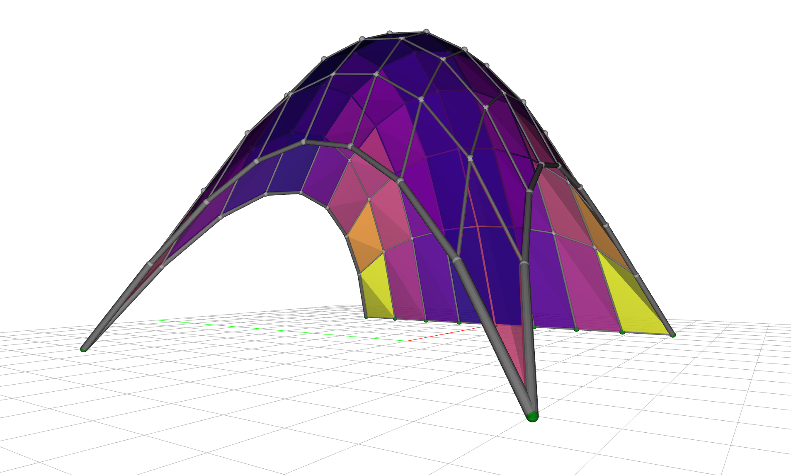
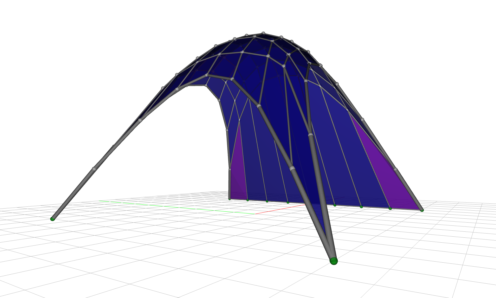
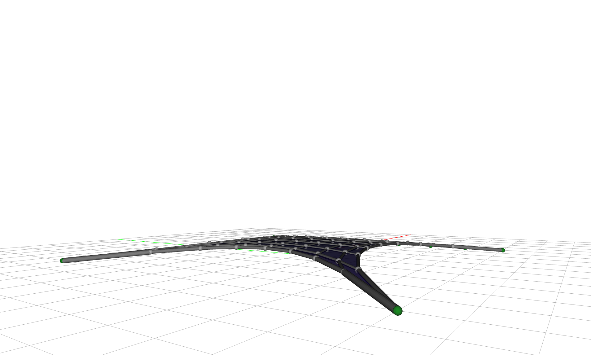
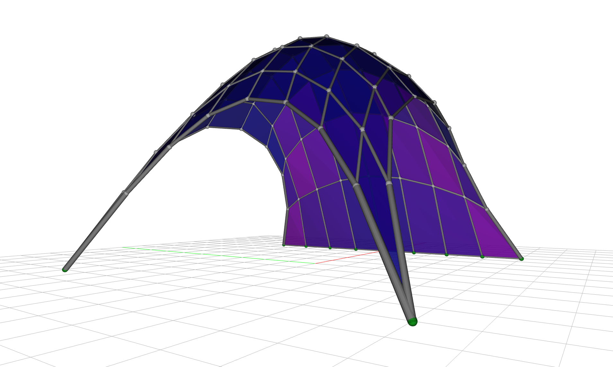
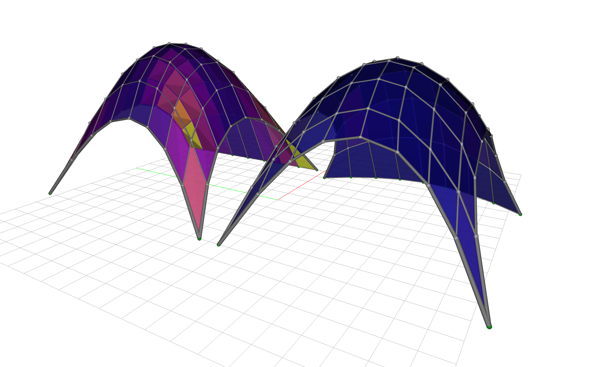

# Gridshell Planarization

Visual intent for gridshell design can be resolved using [shape matching](shape_matching.md). But fabrication aspects are equally, if not more important, to translate a visual concept into physical reality. Here we sculpt a compressive, rigid gridshell so that every one of its quad faces is flat[^triangle].

This example is motivated because a gridshell is only as buildable and affordable as its cladding. Cover the gridshell skin with glass and each quad face becomes a panel to fabricate. A **planar** quad is cut from flat stock, so it is standardized and cheap. A **warped** quad has to be cold-bent, cast on a custom mould, or split into triangles, all of which cost money and multiply the production effort. On a doubly-curved shell computed by form-finding, the faces are generally warped by default to our demise. Therefore, adjusting such a shape by nudging every quad until its four corners share a plane is one of the highest-leverage moves towards both material efficiency and fabrication economy.[^pq]

In this walkthrough we build the design up one goal at a time and watch the trade-offs play out: planarize, then fair, and then restore the original visual intent. In the last section, we even apply **support-finding** and let some of the supports move too to find a better-performing equilibrium state.

## The starting gridshell

We start from a quad gridshell on a square base: a `FDMesh` meshgrid, centered on the origin.

```python
from compas.geometry import Translation

from jax_fdm.datastructures import FDMesh


length = 10.0
nx = 8

mesh = FDMesh.from_meshgrid(length, nx=nx)
mesh.transform(Translation.from_vector([-length / 2.0, -length / 2.0, 0.0]))
```

We support the four corners and, to make the design a little more interesting, one full boundary side. A downward load hangs on every free vertex, and a negative force density puts the shell into a compressive axial-force state. We give the free boundary edges a stiffer force density than the interior, so the perimeter tautens and the shell spreads to cover more area underneath.

```python
pz = -1.0
q0 = -1.0
q0_boundary = -5.0

corners = list(mesh.vertices_where(vertex_degree=2))
side = list(mesh.vertices_where(x=length / 2.0))
for vertex in corners + side:
    mesh.vertex_support(vertex)

for vertex in mesh.vertices_free():
    mesh.vertex_load(vertex, [0.0, 0.0, pz])

for edge in mesh.edges():
    if mesh.is_edge_on_boundary(edge) and not mesh.is_edge_fully_supported(edge):
        mesh.edge_forcedensity(edge, q0_boundary)
    else:
        mesh.edge_forcedensity(edge, q0)
```

Form-finding gives us a funicular geometry for the compressive shell.

```python
from jax_fdm.equilibrium import fdm


shell = fdm(mesh)
```



The shell rises to about 7.2 meters. But it is doubly curved and warped: the worst face reads a flatness of **12.8**, meaning almost thirteen times past the tolerance we can build to (a 1% relative diagonal gap, see the note below), and only **28% of the faces** come in under the threshold. Clad as-is, most panels would need bending or a bespoke mould. We would like the faces flat.

!!! note "Measuring flatness against a budget"

    A raw distance ("the worst quad is 142 mm out of plane") tells us little without knowing the panel size, so we use the scale-free planar-quad metric: the *diagonal gap* (the shortest distance between a quad's two diagonals, which meet only when it is flat) divided by the average edge length, and then divided by a manufacturing tolerance `maxdev`.
    Here, we take that tolerance as 1%. The reading is thus a fraction of the flatness budget: **below 1.0 a panel is within tolerance and can be clad flat - above 1.0 it cannot.**

We can read the panel flatness straight off the mesh, as a fraction of the manufacturing tolerance, and count how many panels come in under budget:

```python
import numpy as np


maxdev = 0.01  # 1% flatness tolerance
flatness = [shell.face_flatness(face, maxdev=maxdev) for face in shell.faces()]

print(f"Face flatness (fraction of tolerance): mean {np.mean(flatness):.2f}  max {np.max(flatness):.2f}")
print(f"Panels within tolerance: {sum(f <= 1.0 for f in flatness)} of {len(flatness)}")
```

To see it, we color each face by its flatness on a shared scale, so the initial shell reads hot (warped) and the optimized one cool (flat), and the worst panels stand out.


## Planarize: flat faces at a price

The force densities are our design variables, which remain negative so that the shell stays compressive. The [`MeshPlanarityGoal`](../api/jax_fdm.goals.md) drives the average face non-planarity to zero.

```python
from jax_fdm.equilibrium import constrained_fdm
from jax_fdm.goals import MeshPlanarityGoal
from jax_fdm.losses import Loss
from jax_fdm.losses import PredictionError
from jax_fdm.optimization import LBFGSB
from jax_fdm.parameters import EdgeForceDensityParameter


parameters = [EdgeForceDensityParameter(edge, -50.0, -0.01) for edge in mesh.edges()]

loss = Loss(PredictionError([MeshPlanarityGoal()], name="Planarity"))

shell_planar = constrained_fdm(
    mesh,
    optimizer=LBFGSB(),
    loss=loss,
    parameters=parameters,
    maxiter=5000,
    tol=1e-8,
)
```

The faces flatten dramatically, the worst dropping from 12.8 to about **2.4** times the tolerance and **97% of the faces** now under the threshold, up from 28%, and the shell stays compressive. This is awesome news! But look closely and the surface has gone **ragged**: the quads are flat but their sides are uneven. A planar-but-ragged gridshell is often no easier to build than a smooth-but-warped one because we are just pushing the fabrication complexity from the cladding to the gridshell nodes and members. Let's do something about it.



## Smoothing the shape

The raggedness is a classic symptom of an under-constrained optimization: many force-density combinations flatten the faces, and the optimizer lands on a spiky one. The remedy is to add a **fairness energy**, a term that prefers smooth solutions, as a regularizer.

We use the [`MeshSmoothGoal`](../api/jax_fdm.goals.md), a discrete fairness energy where each vertex is drawn toward the centroid of its neighbors, so the surface irons itself out.[^tang]

```python
from jax_fdm.goals import MeshSmoothGoal


loss = Loss(
    PredictionError([MeshPlanarityGoal()], alpha=1.0, name="Planarity"),
    PredictionError([MeshSmoothGoal()], alpha=0.03, name="Smoothness"),
)
```

The raggedness collapses and the faces stay flat, with **100% of the faces** now under the threshold, so on those two counts we have won. Can we chant victory yet? Not quite. The fairness energy has a side effect we cannot ignore: left to its own devices it squashes the shell toward the ground. The rise drops from 7 meters to under half a meter, and the geometry drifts more than 4 meters from the shape we started with.



!!! warning "Smoothing pulls the shell flat"

    On its own, `MeshSmoothGoal` minimizes toward a flat sheet, the lowest-energy fair surface. It fairs the net beautifully and flattens the shell along with it. Something has to anchor the height.

## Restoring the looks

We come full circle by adding the goal from the [shape matching](shape_matching.md) example: a per-vertex [`VertexPointGoal`](../api/jax_fdm.goals.md) that pulls every free vertex back toward its position on the original form-found shell. It anchors the rise the smoothing goal was giving away, and biases the whole solution toward the design we intended.

```python
from jax_fdm.goals import VertexPointGoal


shape = {vertex: shell.vertex_coordinates(vertex) for vertex in mesh.vertices_free()}
goals_shape = [VertexPointGoal(vertex, target=shape[vertex]) for vertex in mesh.vertices_free()]

loss = Loss(
    PredictionError([MeshPlanarityGoal()], alpha=1.0, name="Planarity"),
    PredictionError([MeshSmoothGoal()], alpha=0.03, name="Smoothness"),
    MeanSquaredError(goals_shape, alpha=0.07, name="ShapeFidelity"),
)
```

Now the three goals balance. The shell recovers its rise (back to about 6.8 meters), the surface stays fair, and the geometry sits close to the shape we designed (a drift of about 0.4 meters), all while remaining a compression-only structure. Flatness pays for it, though: with the shape goal pulling back toward the warped form-found surface, only **81% of the faces** now come in under the threshold (worst about **2.9** times tolerance), down from the 97% that planarizing alone reached. Victory, almost! The three `alpha` weights are design knobs too: dialing them trades panel flatness against smoothness against fidelity to the original form.



!!! tip "Why three goals and not one"

    Each goal alone fails: planarity ragged, smoothing collapsed, shape unplanar. It is their *composition* that lands a buildable design, and the differentiable force density method balances them in a single gradient-based solve. Weighting them is how a designer expresses which trade-off they prefer.

## Bonus: Support-finding

The shape stage left us at 81% under budget: roughly a fifth of the panels are still too warped to build. What if, on top of the force densities, we could nudge the supports too? So far the optimizer has only moved force densities. But the boundary supports are geometry too, and the differentiable method can treat them as design variables just as readily, something a forward form-finder cannot do. This is *support-finding*: we let each support on the pinned side slide in and out along the edge, by up to 10% of the base length, so the optimizer places the supports where they best serve the three goals at once.

```python
from jax_fdm.parameters import VertexSupportXParameter


parameters = [EdgeForceDensityParameter(edge, -50.0, -0.01) for edge in mesh.edges()]
for vertex in side:
    x = shell.vertex_coordinates(vertex)[0]
    xtol = 0.1 * length  # let the support slide by up to 10% of the base length
    parameters.append(VertexSupportXParameter(vertex, x - xtol, x + xtol))
```

With the supports free to move, the same three-goal solve finds a better optimum: the worst face drops to about **0.6** of the tolerance, so **100% of the faces** are now within the flatness budget, up from 81%, as the boundary reshapes itself to help the faces lie flat. The supports travel about 0.6 meters on average to get there, morphing the initially linear boundary into a soft arch at the base of the structure. Thought we could not do better? Check out the before and after and see for yourself.




## Summary

In retrospect, adding one goal at a time in tabular form is helpful to trace performance trade-offs. Each column in the table below is a design quantity: the shell's rise, the worst face's flatness (as a fraction of the 1% budget), the share of panels under that budget, and how far the geometry drifts from the form-found shell.

| Stage | Rise (m) | Worst flatness | Faces under budget | Shape drift (m) |
| --- | --- | --- | --- | --- |
| Form-found shell | 7.2 | 12.8 | 28% | — |
| Planarize | 6.8 | 2.4 | 97% | 1.13 |
| + Smoothing | 0.5 | 0.4 | 100% | 4.30 |
| + Shape matching | 6.8 | 2.9 | 81% | 0.38 |
| + Support-finding | 6.9 | 0.6 | 100% | 0.33 |

Read down the rows: planarizing flattens the panels but ragged; smoothing perfects flatness but collapses the shell and abandons the design; shape matching restores the form at a real flatness cost, leaving a fifth of the panels over budget; and support-finding recovers full buildability while holding the shape. No single goal wins on every column, which is exactly why it is a good idea to compose them. And JAX FDM gives us the tools to do so.

## Where to next

- Curious how goals, losses, and the optimizer fit together? Read [constrained form-finding](../howto/constrained_form_finding.md).
- Want to match a shape rather than flatten faces? See [shape matching](shape_matching.md).
- The runnable script for this example lives in [`examples/gridshell/gridshell_planarization.py`](https://github.com/arpastrana/jax_fdm/blob/main/examples/gridshell/gridshell_planarization.py).

[^triangle]:
    We could have chosen a gridshell layout with triangular faces to obtain flat panels from the outset, but where is the fun in that.

[^pq]:
    Planar-quad (PQ) meshes are a central topic in architectural geometry precisely because of this fabrication economy. See Pottmann et al., *Architectural Geometry* (Bentley Institute Press, 2007).

[^tang]:
    The fairness energy is the smoothness term of Tang, Sun, Gomes, Wallner and Pottmann, *Form-finding with Polyhedral Meshes Made Simple*, ACM Transactions on Graphics 33(4), SIGGRAPH 2014, [doi:10.1145/2601097.2601213](https://doi.org/10.1145/2601097.2601213).
