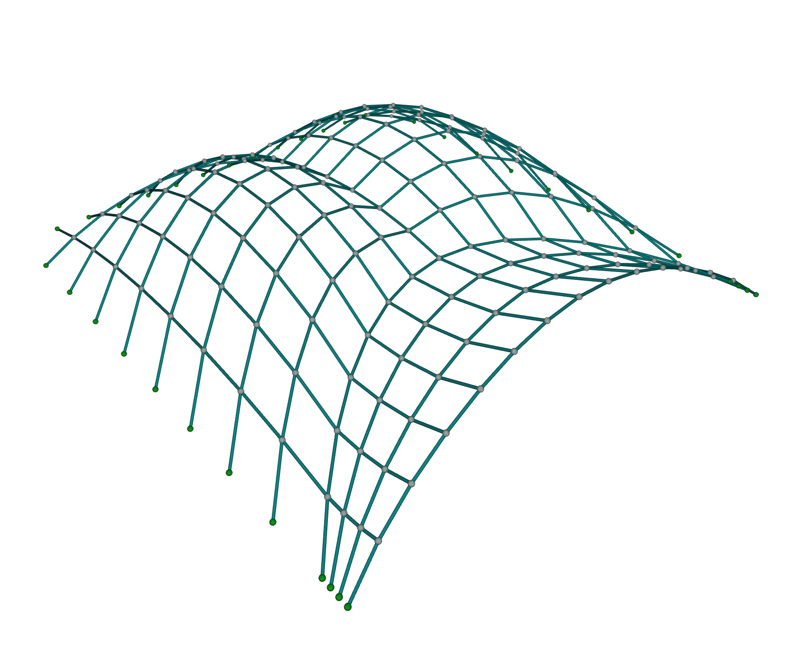
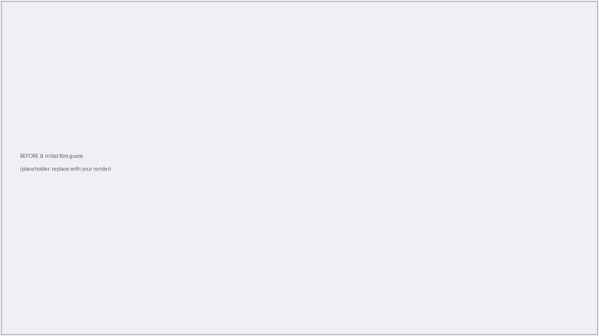
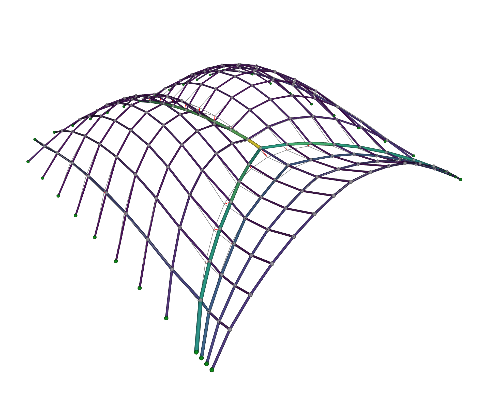

# Shape Matching

The [arch optimization](arch.md) example minimized a mechanical quantity, the load path energy.
This time the design intent is *visual*: you have a shape in mind, and you want a structure that looks like it while still standing up under self-weight in pure compression.

Why would this matter, you wonder?
A funicular geometry, one that carries its loads through axial forces alone, is mechanically efficient: it is the shape a hanging net or a masonry vault naturally wants to take.
But left alone, form-finding gives you *a* funicular shape, not necessarily *the* one your design calls for.
Shape matching lets you steer the force density method toward a target surface, so mechanical efficiency and your visual intent meet in the same geometry.[^cmame]
It is how one designs compression-only gridshells and thin shells that keep an envisioned silhouette.
Another useful application of shape matching is to assess whether an existing masonry vault can stand as a thrust network.

In this walkthrough we will approximate a doubly-curved **creased shell** with a compression-only network.
The approach is the same one that scales to any target: pick a shape, form-find a first guess, then let the optimizer find the force densities that best fit the target.

## The target

Our design intent is a `creased_shell` network, a doubly-curved surface with a sharp ridge running across it, and it ships with JAX FDM (swap in your own network whenever you like).

```python
from jax_fdm.datastructures import FDNetwork
from jax_fdm.visualization import Viewer


network = FDNetwork.from_json("data/json/creased_shell.json")

viewer = Viewer()
viewer.add(network)
viewer.show()
```



This 193-node, 324-edge network is the shape we want to approximate, so we record every node's position as the target to aim for before we touch anything.

```python
targets = {node: network.node_coordinates(node) for node in network.nodes()}
```

Now we set up the structural problem on that same network: support it along its perimeter (the leaf nodes, in graph-theory lingo), hang a small downward point load on every free node, and seed every edge with a constant force density, the same starting guess for all of them.

```python
supports = [node for node in network.nodes() if network.is_leaf(node)]
network.nodes_supports(supports)
network.nodes_loads([0.0, 0.0, -0.2], keys=network.nodes_free())
network.edges_forcedensities(q=-1.0)
```

The negative force density puts every edge in compression, since we are looking for a compression-only solution.

## Before: a first guess

What does that constant force density give you on its own?
We run one plain form-finding pass to see.

```python
from jax_fdm.equilibrium import fdm


network_guess = fdm(network)

viewer = Viewer()
viewer.add(network_guess, edgecolor="fd")
viewer.add(network.copy(cls=Network), color=Color.grey())

viewer.show()
```



The result is funicular, it hangs in equilibrium, and it even reaches roughly the right overall height, rising to about 4.3 meters against the creased target's 4.5.
But a shared force density can only produce a smooth, rounded dome, rounding off exactly the features that make the target distinctive, above all its sharp crease.
So while the silhouette is in the ballpark, the fit node by node is poor: the free nodes sit about 1.2 meters from their targets on average, and the [Hausdorff distance](https://en.wikipedia.org/wiki/Hausdorff_distance), the largest gap between the two, is about 5.2 meters.
To sharpen the shape the force densities need to *vary* across the network, and finding that variation by hand is hopeless.
That is a job for optimization.

## After: the optimized match

We want the force densities that pull the form-found network as close to the target as possible.
Three pieces express that intent.

**The parameters** are the force densities of every edge, free to move between a lower and an upper bound.
Keeping both bounds negative holds the whole structure in compression throughout the search.

```python
from jax_fdm.parameters import EdgeForceDensityParameter

parameters = []
for edge in network.edges():
    parameter = EdgeForceDensityParameter(edge, -20.0, 0.0)
    parameters.append(parameter)
```

**The goals** ask each free node to reach its counterpart on the target.
We create one [`NodePointGoal`](../api/jax_fdm.goals.md) per free node, aimed at the target's coordinates for that node.

```python
from jax_fdm.goals import NodePointGoal


goals = []
for node in network.nodes_free():
    goal = NodePointGoal(node, target=targets[node])
    goals.append(goal)
```

**The loss** measures how far, on average, the nodes land from their targets.
The root-mean-squared error reports that gap in the units of the problem, meters, which makes it easy to reason about.

```python
from jax_fdm.losses import Loss
from jax_fdm.losses import RootMeanSquaredError


loss = Loss(RootMeanSquaredError(goals))
```

Minimizing this loss would be a least-squares match.
An exact fit would drive it to zero, but for an arbitrary target that is unlikely, since it would mean the target was already funicular (we are often not that lucky).
The optimizer instead finds the funicular geometry that comes closest.

Once the problem is defined, we hand the problem to `constrained_fdm` with a gradient-based optimizer.
`LBFGSB` handles the bounded force densities well and converges rapidly.

```python
from jax_fdm.equilibrium import constrained_fdm
from jax_fdm.optimization import LBFGSB


network_matched = constrained_fdm(
    network,
    optimizer=LBFGSB(),
    loss=loss,
    parameters=parameters,
    maxiter=1000,
    tol=1e-6,
)
```



The optimized network now captures the crease the guess had rounded away, and the Hausdorff distance drops from 5.2 meters to 0.70, an order of magnitude closer.
The force densities follow a non-trivial distribution across the edges, exactly the spread a single constant value could never provide, and every one of them stayed negative, so the match is compression-only as intended.

!!! tip "Why the match matters mechanically"

    The payoff is not only visual. A shape close to funicular carries its loads mostly through axial forces rather than bending, which is what makes shells and gridshells so material-efficient. Nudging an arbitrary target toward its nearest compression-only geometry can cut its strain energy substantially, so a small geometric change buys an outsized gain in structural performance.

## Interrogating the result

We can measure the quality of the fit directly, the same way the numbers above were computed, with a Hausdorff distance between the two point sets:

```python
from scipy.spatial.distance import directed_hausdorff


matched = [network_matched.node_coordinates(n) for n in network_matched.nodes()]
target = [targets[n] for n in network_matched.nodes()]

forward = directed_hausdorff(matched, target)[0]
backward = directed_hausdorff(target, matched)[0]
hausdorff = max(forward, backward)
print(f"Hausdorff distance: {hausdorff:.3f}")
```

To see the match, we draw the optimized network colored by its force densities next to the target as a plain wireframe, with a line from each node to the target point it was chasing.
A fresh load of `creased_shell.json` gives us the target surface back as its own network to draw.

```python
from compas.colors import Color
from compas.datastructures import Network
from compas.geometry import Line


network_target = FDNetwork.from_json("data/json/creased_shell.json")

viewer = Viewer()
viewer.add(network_matched, edgecolor="fd")
viewer.add(network.copy(cls=Network), color=Color.grey())

for node in network_matched.nodes():
    line = Line(network_matched.node_coordinates(node), targets[node])
    viewer.add(line, color=Color.red())

viewer.show()
```

The red lines, so prominent in the initial guess, shrink to almost nothing after optimization, a visual echo of the collapsed Hausdorff distance.

## Where to next

- Curious how the loss, goals, and optimizer fit together? Read [constrained form-finding](../howto/constrained_form_finding.md).
- Want a target the goal bank does not cover? Write a [custom goal](../howto/custom_goals.md).
- The runnable script for this example lives in [`examples/creased_shell/creased_shell.py`](https://github.com/arpastrana/jax_fdm/blob/main/examples/creased_shell/creased_shell.py).

[^cmame]:
    The shape-matching task, and the strain-energy analysis behind the efficiency claims, are studied in detail in Pastrana et al., *Differentiable force density method for the design of lightweight structures*, Computer Methods in Applied Mechanics and Engineering (2026). See the [citation page](../citation.md).
