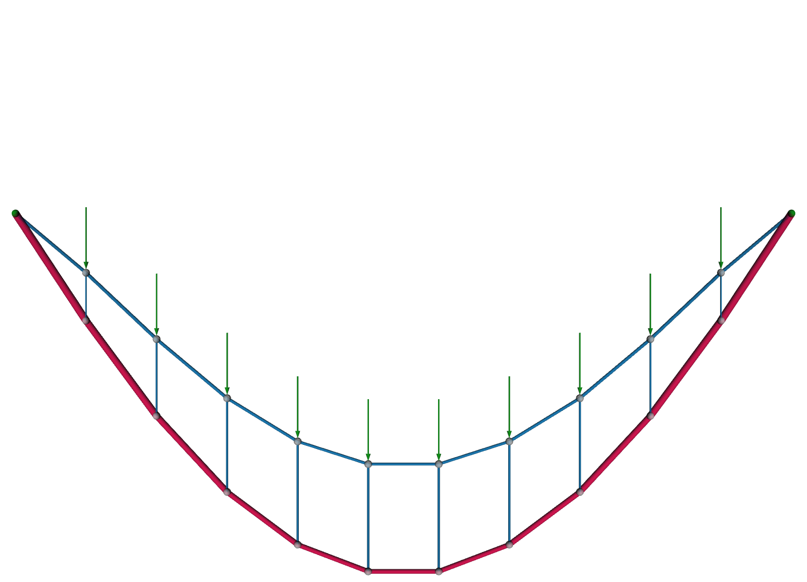
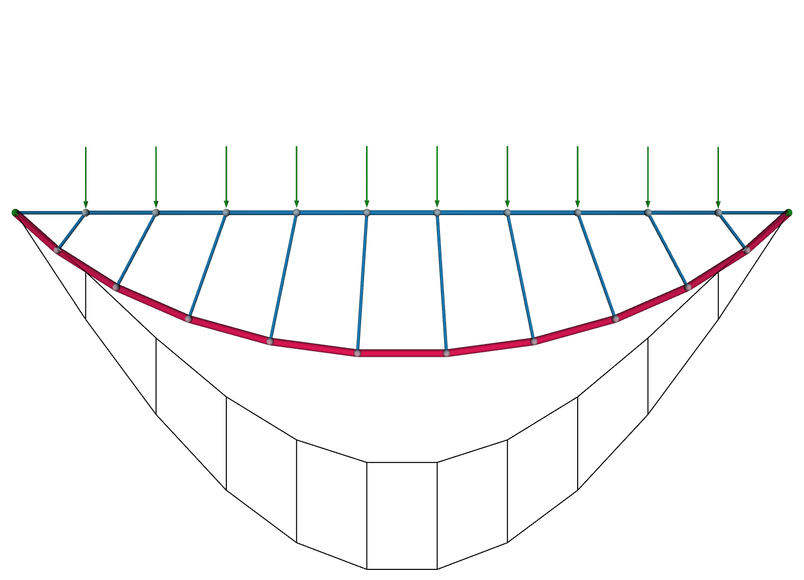
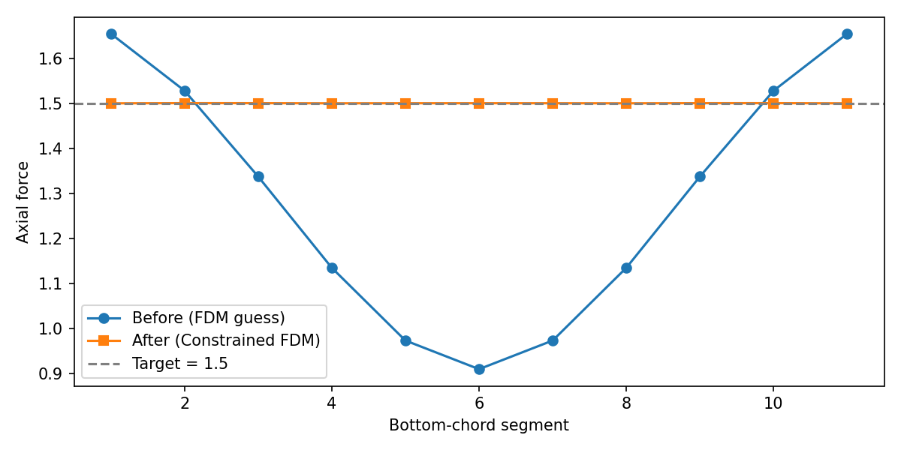

# Equal-Force Truss

The [shape matching](shape_matching.md) example chased a *geometric* target. This one chases a *force* target: we reshape a truss so that one of its chords carries the same internal force everywhere.

Why would we want that? Consider the bottom chord of a planar truss, the tension tie that keeps the two supports from spreading apart. In a typical design its internal force varies from segment to segment, so each segment wants a different cross-section: thicker where the force is high, thinner where it is low. That is a fabrication headache. Every change of section is a detail to design, a splice to connect, and a place where mechanical continuity can go wrong.

If instead the force were *uniform* along the whole chord, we could build it from a **single, constant cross-section**, a cable or a rod of one size, used at its full capacity end to end. One section, no splices to reconcile, maximal material utilization. That is the payoff, and it is a classic problem in graphic statics.[^gs]

In this walkthrough we start from a [Vierendeel-like](https://en.wikipedia.org/wiki/Vierendeel_bridge) truss (a top chord, a bottom chord, and vertical struts, no diagonal bracing) and let the force density method morph the bottom chord into the shape that makes its force constant, all while keeping the top chord straight.

!!! note "The graphic-statics reading"

    Classically, this problem is solved by drawing the truss's *reciprocal force diagram*, a companion figure in which every member maps to a line whose length is proportional to the member's axial force. A constant-force chord is then simply one whose reciprocal lines are all the same length, and the designer reshapes the truss by editing that diagram by hand.[^gs] Here we arrive at the same design from the force side too, but through the force density method: the design variables are the edge force densities, so we search in the force domain and read the equilibrium shape back out, rather than moving nodes around and hoping the forces cooperate.[^cmame]

## The truss

The truss lives in a vertical plane. We build three families of members:

- a **top chord**, a straight line of nodes between the two supports,
- a **bottom chord**, a second line of nodes below it,
- **struts**, verticals tying each bottom node up to a top node.

Since every node sits at an evenly spaced station along the x axis, we can place the points by hand, no geometry library needed. The top chord runs along `y=0`, and the bottom chord hangs below it at `y=depth`. Its two ends are dropped so the bottom chord meets the supports directly.

```python
from compas.itertools import pairwise

from jax_fdm.datastructures import FDNetwork


length = 5.0
num_segments = 11
depth = -2.0

step = length / num_segments
xs = [-length / 2.0 + i * step for i in range(num_segments + 1)]

top_points = [[x, 0.0, 0.0] for x in xs]
bottom_points = [[x, depth, 0.0] for x in xs[1:-1]]  # interior only; the ends meet the supports
```

With the points in hand, we add the nodes to an empty network (top chord first, then the bottom chord) and wire up the three families of edges: the top and bottom chords, and the struts between them. The bottom chord runs support to support, so its end segments meet the top-chord supports directly.

```python
network = FDNetwork()

top_nodes = [network.add_node(x=x, y=y, z=z) for x, y, z in top_points]
top_nodes_free = top_nodes[1:-1]  # every top node but the two supports
bottom_nodes = [network.add_node(x=x, y=y, z=z) for x, y, z in bottom_points]

bottom_chord = [top_nodes[0]] + bottom_nodes + [top_nodes[-1]]
top_edges = [network.add_edge(u, v) for u, v in pairwise(top_nodes)]
bottom_edges = [network.add_edge(u, v) for u, v in pairwise(bottom_chord)]
strut_edges = [network.add_edge(u, v) for u, v in zip(bottom_nodes, top_nodes_free)]
```

The two chord ends are the supports, and every free top node carries a small downward load. The top-chord edges get a compressive (negative) force density, the bottom chord a tensile (positive) one, and the struts a mild compressive one, our starting guess.

```python
network.node_support(top_nodes[0])
network.node_support(top_nodes[-1])

for node in top_nodes_free:
    network.node_load(node, [0.0, 0.0, -0.2])

for edge in top_edges:
    network.edge_forcedensity(edge, -1.0)

for edge in bottom_edges:
    network.edge_forcedensity(edge, 2.0)

for edge in strut_edges:
    network.edge_forcedensity(edge, -0.5)
```

## Before: uneven force along the bottom chord

We form-find the truss once to see the starting state.

```python
from jax_fdm.equilibrium import fdm


network_guess = fdm(network)
```



The truss hangs in equilibrium, but the force in the bottom chord is far from uniform: it ranges from about 0.9 near midspan to 1.7 near the supports, a spread of nearly two to one. Built literally, this chord would need a fat cross-section at the ends tapering to a thin one in the middle, with every joint between sections to detail and splice. We would like to do better.

Working in the force domain also sidesteps a headache that a conventional analysis would hit here. Because our truss has no diagonal bracing, it is not fully triangulated, and a stiffness-based solver would see a singular stiffness matrix and stall unless we added members we do not want. Form-finding never assembles that matrix. It only ever produces equilibrated states, so the un-triangulated truss is solved as readily as any other.

## Defining the equal-force problem

We want the bottom-chord segments to *all carry the same force*, at a value we choose, while the top chord stays a clean straight line. Two goals, bundled into one loss, say exactly that.

**A target force** on every bottom edge does the equalizing. We aim each of them at the same value, here 1.5. If they all reach it, they are equal by construction, so there is no need for a separate goal to compare them against each other.

```python
from jax_fdm.goals import EdgeForceGoal


goals_force = [EdgeForceGoal(edge, target=1.5) for edge in bottom_edges]
```

**A colinearity goal** keeps the top chord straight. `NodesColinearGoal` penalizes any top node that strays off the line through its neighbors, so the top chord stays the clean straight member a Vierendeel truss expects, and only the bottom chord is left free to morph.

```python
from jax_fdm.goals import NodesColinearGoal


goals_colinear = [NodesColinearGoal(key=top_nodes)]
```

We assemble the two into a single loss. The forces are measured as a squared error toward their set value, and the colinearity term is a prediction error, driving the top chord's off-line deviation straight to zero.

```python
from jax_fdm.losses import Loss
from jax_fdm.losses import MeanSquaredError
from jax_fdm.losses import PredictionError


loss = Loss(
    MeanSquaredError(goals_force, name="ForceTarget"),
    PredictionError(goals_colinear, name="ColinearTopChord"),
)
```

## After: one force, one cross-section

We hand the loss to `constrained_fdm`. Here the design variables are the force densities of every edge, and with no explicit `parameters` the optimizer takes them all by default.

```python
from jax_fdm.equilibrium import constrained_fdm
from jax_fdm.optimization import LBFGSB


network_equalforce = constrained_fdm(
    network,
    optimizer=LBFGSB(),
    loss=loss,
    maxiter=10000,
    tol=1e-9,
)
```



The bottom chord has settled into a shallow curve, and its force is now uniform: every segment carries between 1.494 and 1.500, essentially the 1.5 we asked for, down from the two-to-one spread we started with. The top chord stayed straight, so the truss keeps its Vierendeel character. The morphed bottom chord is now a single-section tie, buildable from one cable, used at its full capacity along its entire length.



!!! tip "Why equal force is worth the trouble"

    A member sized to its allowable stress needs a cross-sectional area proportional to the force it carries: $A = |F| / \sigma$. So a chord whose force is uniform can be a single, constant cross-section sized once to its capacity, one profile to buy, one connection detail to repeat, and no material wasted on segments that never see the peak force. Letting the geometry absorb the force variation, rather than the cross-section, is a small change to the shape that pays off in fabrication and material rationality.

## Reading the result

You can read the bottom-chord forces straight off the optimized network to confirm the match:

```python
forces = [network_equalforce.edge_force(edge) for edge in bottom_edges]
print([round(f, 3) for f in forces])
```

To see it, we draw the initial guess as a plain wireframe next to the optimized truss colored by its member forces.

```python
from compas.datastructures import Network
from jax_fdm.visualization import Viewer


viewer = Viewer()
viewer.add(network_guess.copy(cls=Network))
viewer.add(network_equalforce, edgewidth=0.05, edgecolor="force", show_nodes=False)
viewer.show()
```

## Where to next

- Curious how goals, losses, and the optimizer fit together? Read [constrained form-finding](../howto/constrained_form_finding.md).
- Want to match a shape instead of a force? See [shape matching](shape_matching.md).
- The runnable script for this example lives in [`examples/truss/truss_equal_force.py`](https://github.com/arpastrana/jax_fdm/blob/main/examples/truss/truss_equal_force.py).

[^cmame]:
    Equal-force and other force-controlled design tasks with the differentiable force density method are studied in Pastrana et al., *Differentiable force density method for the design of lightweight structures*, Computer Methods in Applied Mechanics and Engineering (2026). See the [citation page](../citation.md).

[^gs]:
    The constant chord-force truss is a classical graphic-statics exercise. See Zalewski and Allen, *Shaping Structures: Statics* (Wiley, 1998), and its use as an optimization benchmark in Beghini et al., *Structural optimization using graphic statics*, Structural and Multidisciplinary Optimization 49 (2014), 351–366, [doi:10.1007/s00158-013-1002-x](https://doi.org/10.1007/s00158-013-1002-x).
